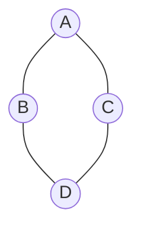
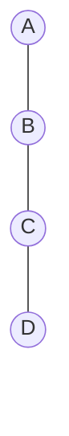
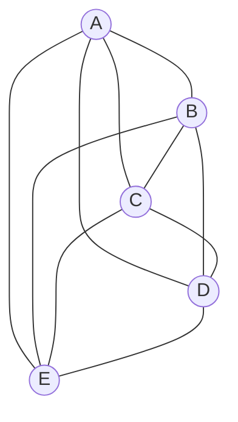
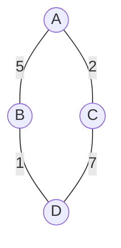
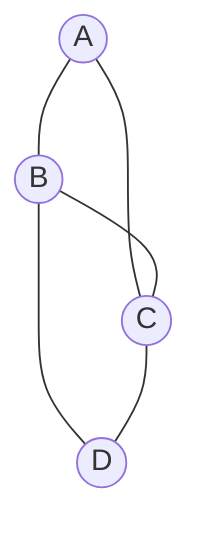
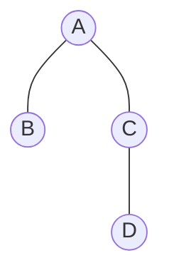

tags: [[Data Structures]]

### **What is a Graph Data Structure? Explain its Properties.**

A **graph** is a non-linear data structure consisting of a **finite set of vertices (nodes)** and a **set of edges** that connect pairs of vertices.

**Properties:**

- **Vertices (V):** Fundamental units (nodes).
- **Edges (E):** Connections between vertices.
- **Directed vs Undirected:** Edges may have direction.
- **Weighted vs Unweighted:** Edges may carry weights (cost, distance, etc.).
- **Degree of a Vertex:** Number of edges incident on a vertex.
- **Path:** Sequence of vertices connected by edges.
- **Cycle:** Path where the first and last vertices are the same.

Undirected Graph Example:



**Real-world Applications:**

- Social networks (users as nodes, friendships as edges).
- Road maps (cities as nodes, roads as weighted edges).
- Web page linking (pages as nodes, hyperlinks as directed edges).

### **How Do You Represent a Graph in Programming?**

Graphs can be represented in two common ways:

1. **Adjacency Matrix** (2D array representation)
    - Space complexity: (O(V^2)).
    - Good for dense graphs.

```java
class GraphMatrix {
    int[][] adjMatrix;
    int vertices;

    GraphMatrix(int v) {
        vertices = v;
        adjMatrix = new int[v][v];
    }

    void addEdge(int src, int dest) {
        adjMatrix[src][dest] = 1;
        adjMatrix[dest][src] = 1; // for undirected graph
    }
    
    void printGraph() {
        System.out.println("Adjacency Matrix:");
        for (int i = 0; i < vertices; i++) {
            for (int j = 0; j < vertices; j++) {
                System.out.print(adjMatrix[i][j] + " ");
            }
            System.out.println();
        }
    }
    
    public static void main(String[] args) {
        GraphMatrix g = new GraphMatrix(5);

        g.addEdge(0, 1);
        g.addEdge(0, 4);
        g.addEdge(1, 2);
        g.addEdge(1, 3);
        g.addEdge(1, 4);
        g.addEdge(2, 3);
        g.addEdge(3, 4);

        g.printGraph();
    }
}
```

2. **Adjacency List** (List of lists)
    - Space complexity: (O(V + E)).
    - Efficient for sparse graphs.

```java
import java.util.*;

class GraphList {
    private List<List<Integer>> adjList;

    GraphList(int v) {
        adjList = new ArrayList<>();
        for (int i = 0; i < v; i++) {
            adjList.add(new ArrayList<>());
        }
    }

    void addEdge(int src, int dest) {
        adjList.get(src).add(dest);
        adjList.get(dest).add(src); // undirected
    }
    
    void printGraph() {
        for (int i = 0; i < adjList.size(); i++) {
            System.out.print(i + " -> ");
            for (int neighbor : adjList.get(i)) {
                System.out.print(neighbor + " ");
            }
            System.out.println();
        }
    }
    
    public static void main(String[] args) {
        GraphList g = new GraphList(5);
        g.addEdge(0, 1);
        g.addEdge(0, 4);
        g.addEdge(1, 2);
        g.addEdge(1, 3);
        g.addEdge(1, 4);
        g.addEdge(2, 3);
        g.addEdge(3, 4);

        g.printGraph();
    }
}
```

### **What is a Sparse Graph?**

- A graph with **relatively few edges** compared to the maximum possible.
- If a graph has (V) vertices, the maximum number of edges in an undirected graph is: \frac{V(V-1)}{2}
- A graph is considered **sparse** if the number of edges (E) is closer to (V) than to (V^2).
- **Space-efficient representation:** Adjacency List.

**Example (Sparse Graph with 4 nodes, only 3 edges):**



### **What is a Dense Graph?**

- A graph with **many edges**, close to the maximum possible.
- In a dense graph, most pairs of vertices are directly connected.
- A graph is considered **dense** if (E) is close to (V^2).
- **Space-efficient representation:** Adjacency Matrix.

**Example (Dense Graph with 5 nodes, almost fully connected):**



### **What is the difference between Directed and Undirected Graphs?**

| Feature        | Directed Graph (Digraph)  | Undirected Graph      |
| -------------- | ------------------------- | --------------------- |
| Edge Direction | One-way (A → B)           | Two-way (A — B)       |
| Representation | Ordered pairs (u,v)       | Unordered pairs {u,v} |
| Example        | Twitter (follow relation) | Facebook (friendship) |

### **What is a Weighted Graph? Give an example.**

A **weighted graph** assigns a numerical value (weight) to each edge, representing cost, distance, or capacity.

**Example: Road Map**

- Cities = vertices
- Roads = edges
- Distance = weight




### **Explain BFS (Breadth-First Search) and DFS (Depth-First Search) in a Graph.**

**BFS (Level-order traversal):**

- Explores neighbors first.
- Uses a **queue**.
- Time complexity: (O(V + E)).

```java
public void BFS(int start) {
    boolean[] visited = new boolean[adjList.length];
    Queue<Integer> queue = new LinkedList<>();
    visited[start] = true;
    queue.add(start);

    while (!queue.isEmpty()) {
        int node = queue.poll();
        System.out.print(node + " ");
        for (int neighbor : adjList[node]) {
            if (!visited[neighbor]) {
                visited[neighbor] = true;
                queue.add(neighbor);
            }
        }
    }
}
```

**DFS (Depth-first traversal):**

- Explores deeper before backtracking.
- Uses **recursion** or **stack**.
- Time complexity: (O(V + E)).

```java
public void DFS(int node, boolean[] visited) {
    visited[node] = true;
    System.out.print(node + " ");
    for (int neighbor : adjList[node]) {
        if (!visited[neighbor]) {
            DFS(neighbor, visited);
        }
    }
}
```

**Use Cases:**

- BFS → Shortest path in unweighted graphs.
- DFS → Detecting cycles, topological sorting.

### **What is a Spanning Tree?**

- A **spanning tree** is a subgraph that:    
    - Connects **all vertices** (so the graph is fully connected).
    - Has **no cycles** (so it’s a tree, not a looped network).
    - Uses exactly **V – 1 edges** if there are V vertices.

**Example Graph:**
- Here, the graph has **4 nodes** and **5 edges**. Notice there are cycles (e.g., A–B–C–A).



**Spanning Tree (subset of edges):**
- All 4 nodes are connected.
- Only **3 edges** (since a spanning tree of V nodes always has V-1 edges).
- No cycles.



### **What is a Minimum Spanning Tree (MST)?**

A **Minimum Spanning Tree** is a subset of edges that connects all vertices with the **minimum possible total edge weight** and without cycles.
**Algorithms:**

- **Kruskal’s Algorithm** (Greedy, sorts edges).
- **Prim’s Algorithm** (Expands from a starting node).

**Applications:**

- Network design (telecom, electrical grids).
- Road construction with minimal cost.

### **How do you detect a cycle in a Graph?**

- **Undirected Graph:** Use DFS with parent tracking.
- **Directed Graph:** Use DFS with recursion stack (back edges indicate cycles).

### **What is the difference between a Tree and a Graph?**

| Feature   | Tree                | Graph                     |
| --------- | ------------------- | ------------------------- |
| Structure | Hierarchical        | Network-like              |
| Cycles    | No cycles           | May contain cycles        |
| Edges     | Exactly (V-1) edges | Can have up to (V(V-1)/2) |
| Example   | File system         | Social network            |
